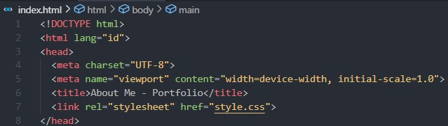
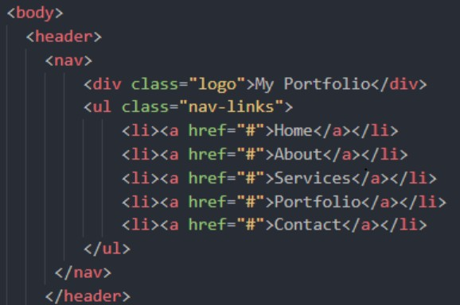
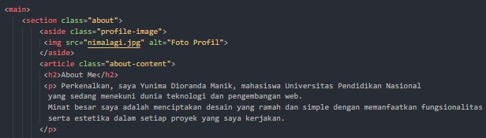
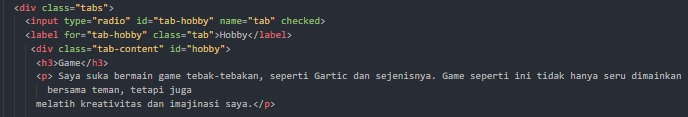
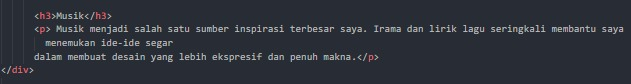
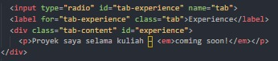
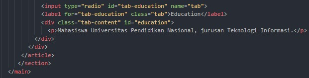

LAPORAN PRAKTIKUM

PEMROGRAMAN WEB

Pratikum: Semantik HTML dan CSS

Oleh:

Yunima Dioranda Manik (42430030)

PROGRAM STUDI TEKNOLOGI INFORMASI

FAKULTAS TEKNIK DAN INFORMATIKA

UNIVERSITAS PENDIDIKAN NASIONAL

2025

PENDAHULUAN

Semantic HTML adalah teknik penulisan kode dengan menggunakan elemen-elemen yang memiliki makna sesuai fungsinya, seperti < header >, < footer >, < article >, < section >, dan < nav >. Elemen-elemen ini membantu menjelaskan peran masing-masing bagian halaman, sehingga struktur dokumen lebih mudah dipahami tidak hanya oleh pengguna, tetapi juga oleh browser dan mesin pencari. Berbeda dengan elemen generik seperti < div > atau < span >, elemen semantik memberikan konteks yang lebih jelas terhadap isi konten. Penerapan Semantic HTML memberikan sejumlah keuntungan penting. Dari sisi aksesibilitas, pengguna dengan keterbatasan tertentu yang memanfaatkan teknologi bantu seperti screen reader dapat lebih mudah menavigasi halaman. Dari segi SEO (Search Engine Optimization), mesin pencari mampu mengenali bagian penting dari halaman dengan lebih baik, sehingga berpotensi meningkatkan peringkat pencarian. Selain itu, keteraturan kode juga terjaga karena struktur dokumen menjadi lebih rapi, konsisten, serta lebih mudah dipelihara dalam jangka panjang. Pada praktik ini, prinsip semantik diterapkan melalui pemilihan elemen yang tepat sesuai fungsi, penggunaan hierarki heading yang logis, serta penambahan atribut aksesibilitas bila dibutuhkan. Di sisi lain, CSS (Cascading Style Sheets) berperan penting dalam mengatur tampilan halaman dengan memisahkan struktur dari presentasi. Melalui CSS, layout diatur menggunakan Flexbox dan Grid agar lebih terstruktur dan responsif. Tipografi diatur melalui pemilihan font, ukuran, serta spasi untuk meningkatkan keterbacaan. Warna dan estetika dihadirkan melalui pemilihan palet yang konsisten serta efek interaktif seperti hover. Tidak kalah penting, responsivitas diterapkan agar halaman dapat tampil optimal pada berbagai perangkat, mulai dari desktop hingga smartphone. Dengan mengombinasikan Semantic HTML dan CSS, halaman web yang dibangun tidak hanya jelas secara struktur dan ramah bagi mesin pencari, tetapi juga memiliki tampilan yang menarik, responsif, serta memberikan pengalaman terbaik bagi pengguna. Kombinasi ini sekaligus menjadi landasan kuat untuk pengembangan fitur interaktif menggunakan JavaScript pada tahap selanjutnya

PEMBAHASAN

Struktur html

Deklarasi DOCTYPE HTML → Menunjukkan bahwa dokumen ini menggunakan standar HTML5.

Tag html lang="id" Menandakan awal dokumen HTML dan memberi tahu browser bahwa bahasa utama halaman ini adalah bahasa Indonesia.

Tag head Bagian yang berisi informasi meta, judul halaman, dan link ke file eksternal.

Meta charset UTF-8 Menentukan karakter encoding yang digunakan adalah UTF-8, sehingga dokumen dapat menampilkan berbagai karakter dan simbol dengan benar.

Meta viewport Mengatur agar halaman web tampil responsif pada perangkat mobile dengan menyesuaikan lebar layar dan skala awal.

Title Menentukan judul halaman yang akan ditampilkan di tab browser, dalam hal ini "About Me - Portfolio".

Link stylesheet Menghubungkan dokumen HTML dengan file CSS eksternal bernama style.css untuk mengatur tampilan (desain) halaman.

Penutup head Menandakan akhir dari bagian < head >

Navbar.html

Tag < body > menandai awal dari bagian tubuh dokumen yang menampilkan konten utama halaman web.

Tag < header > digunakan untuk menampilkan bagian kepala halaman yang biasanya berisi logo atau navigasi utama.

Tag < nav > menunjukkan area navigasi yang berisi tautan ke berbagai bagian halaman atau situs.

Tag < div class="logo">My Portfolio</ div > menampilkan teks "My Portfolio" sebagai logo atau identitas situs, ditempatkan dalam sebuah div dengan class "logo".

Tag < ul class="nav-links" > membuat daftar tidak berurutan (unordered list) dengan class "nav-links" yang digunakan untuk menampung link navigasi.

Tag < li>< a href="#">Home</ a></ li > membuat item daftar dengan tautan bernama "Home". Atribut href="#" menunjukkan bahwa tautan belum diarahkan ke halaman tertentu.

Tag < li>< a href="#">About</ a></ li> membuat item daftar untuk tautan "About".

Tag < li>< a href="#">Services</ a></ li> membuat item daftar untuk tautan "Services".

Tag < li>< a href="#">Portfolio</ a></ li> membuat item daftar untuk tautan "Portfolio".

Tag < li>< a href="#">Contact</ a></ li> membuat item daftar untuk tautan "Contact".

Penutup < /ul> mengakhiri daftar navigasi.

Penutup < /nav> menandakan akhir dari area navigasi.

Penutup < /header> mengakhiri bagian header halaman.

Tag < main > menandai bagian utama dari halaman web yang berisi konten inti.

Tag < section class="about"> membuat sebuah bagian khusus dengan class "about" untuk menampung informasi tentang diri atau profil.

Tag < aside class="profile-image" > digunakan sebagai bagian samping yang menampilkan gambar profil.

Tag < img src="nimalagi.jpg" alt="Foto Profil" > menampilkan gambar dengan sumber file nimalagi.jpg, sementara atribut alt memberikan teks alternatif jika gambar gagal dimuat sekaligus mendukung aksesibilitas.

Penutup aside menandakan akhir dari bagian gambar profil.

Tag < article class="about-content"> menunjukkan konten utama dalam section "about", yaitu deskripsi diri.

Tag < h2>About Me</h2> berfungsi sebagai judul sub-bagian dengan heading level 2.

Tag < p> berisi perkenalan singkat: nama, status mahasiswa, dan bidang yang digeluti yaitu teknologi serta pengembangan web.

Paragraf lanjutan menjelaskan minat utama dalam menciptakan desain yang ramah, sederhana, fungsional, dan estetis di setiap proyek.

Penutup paragraf mengakhiri isi deskripsi diri.

Penutup article menandakan akhir dari bagian konten utama "About".

Penutup section menutup keseluruhan bagian "about".

Penutup main menutup konten utama halaman.

tag < div class="tabs" > membuat wadah dengan class "tabs" yang digunakan untuk menampung seluruh elemen tab.

Tag < input type="radio" id="tab-hobby" name="tab" checked> membuat input bertipe radio button dengan id "tab-hobby". Atribut name="tab" memastikan bahwa input ini termasuk dalam grup tab yang sama, sedangkan checked menandakan tab ini dipilih secara default.

Tag < label for="tab-hobby" class="tab">Hobby</label> membuat label yang terhubung dengan input radio "tab-hobby". Label ini berfungsi sebagai tombol/tab yang dapat diklik pengguna untuk memilih bagian "Hobby".

Tag < div class="tab-content" id="hobby"> menampilkan konten yang muncul ketika tab "Hobby" dipilih.

Tag < h3>Game</h3> memberikan judul sub-bagian di dalam konten, yaitu "Game".

Tag < p> berisi deskripsi hobi: penulis suka bermain game tebak-tebakan seperti Gartic dan sejenisnya. Game ini tidak hanya menyenangkan untuk dimainkan bersama teman, tetapi juga melatih kreativitas dan imajinasi.

Penutup < /p> menandakan akhir paragraf.

Penutup < /div> menutup bagian konten "hobby".

Penutup < /div> terakhir menutup wadah utama dengan class "tabs".

Tag < h3>Musik</ h3> membuat judul sub-bagian dengan heading level 3, yaitu "Musik".

Tag < p> berisi paragraf penjelasan bahwa musik menjadi salah satu sumber inspirasi terbesar. Irama dan lirik lagu sering membantu menemukan ide segar untuk menciptakan desain yang lebih ekspresif dan bermakna.

Penutup < /p> menandakan akhir dari paragraf.

Penutup < /div> menutup wadah div yang menaungi bagian konten "Musik"

	

Tag < input type="radio" id="tab-experience" name="tab"> membuat input berupa radio button dengan id "tab-experience". Atribut name="tab" mengelompokkan input ini ke dalam grup tab yang sama dengan tab lainnya.

Tag < label for="tab-experience" class="tab">Experience</ label> membuat label yang terhubung dengan radio button "tab-experience". Label ini berfungsi sebagai tombol/tab bertuliskan "Experience".

Tag < div class="tab-content" id="experience"> menampung isi atau konten yang ditampilkan saat tab "Experience" dipilih.

Tag < p> berisi teks keterangan tentang proyek selama kuliah, dengan tambahan penekanan kata "coming soon!".

Tag < em>coming soon!</ em> digunakan untuk menandai teks dengan penekanan (biasanya ditampilkan miring/italic), menunjukkan bahwa isi detail proyek akan ditambahkan di kemudian hari.

Penutup < /p> mengakhiri paragraf.

Penutup < /div> menutup kontainer untuk konten tab "Experience

Tag < input type="radio" id="tab-education" name="tab">
Membuat input berupa radio button dengan ID "tab-education". Atribut name="tab" mengelompokkan radio button ini ke dalam grup tab yang sama, sehingga hanya satu tab yang bisa dipilih dalam satu waktu.

Tag < label for="tab-education" class="tab">Education</ label>
Membuat label yang terhubung dengan radio button "tab-education". Label ini bertindak sebagai tombol/tab yang menampilkan teks "Education".

Tag < div class="tab-content" id="education">
Menampung isi atau konten yang akan ditampilkan ketika tab "Education" dipilih oleh pengguna.

Tag < p >
Berisi teks penjelasan bahwa pengguna adalah mahasiswa Universitas Pendidikan Nasional, jurusan Teknologi Informasi.

Isi teks paragraf
Menyatakan status sebagai "Mahasiswa Universitas Pendidikan Nasional, jurusan Teknologi Informasi."

Penutup < /p >
Menandai akhir dari paragraf teks tersebut.

Penutup < /div >
Mengakhiri kontainer untuk konten tab "Education”

Index.css

Selector *
Simbol bintang berfungsi sebagai universal selector, artinya aturan CSS ini akan diterapkan ke semua elemen HTML dalam halaman tanpa kecuali.

Deklarasi margin: 0;
Instruksi ini menghapus jarak bawaan (default margin) yang biasanya diberikan oleh browser pada elemen-elemen tertentu, seperti body, heading (< h1>, < h2>), dan lain-lain. Dengan begitu, semua elemen akan dimulai tanpa margin.

Duplikasi deklarasi margin: 0;
Di dalam blok terdapat dua kali perintah margin: 0;. Padahal satu kali penulisan sudah cukup. Pengulangan ini tidak menimbulkan efek tambahan; hanya redundan dan kemungkinan merupakan kesalahan kecil atau kelalaian dalam menulis kode.

Fungsi keseluruhan
Potongan kode ini bertujuan melakukan reset CSS pada margin, sehingga tampilan halaman lebih konsisten di berbagai browser

Selector body
Mengatur gaya (style) yang akan berlaku untuk seluruh elemen < body> dalam halaman.

Deklarasi font-family: Arial, sans-serif;
Menentukan jenis huruf utama yang digunakan adalah Arial. Jika Arial tidak tersedia, maka browser akan menggunakan jenis huruf cadangan yaitu sans-serif.

Deklarasi display: flex;
Mengubah < body> menjadi flex container, sehingga elemen-elemen di dalamnya dapat diatur menggunakan sistem flexbox.

Deklarasi flex-direction: column;
Mengatur arah susunan elemen di dalam flex container agar ditampilkan secara vertikal (dari atas ke bawah).

Deklarasi min-height: 100vh;
Memberikan tinggi minimum sebesar 100% dari tinggi layar (viewport). Dengan begitu, body selalu memenuhi seluruh tinggi layar meskipun kontennya sedikit.

Deklarasi background-color: #ffd6e0;
Memberikan warna latar belakang pada halaman dengan kode warna hex #ffd6e0, yaitu warna pink muda.

Deklarasi color: #333;
Mengatur warna teks utama menjadi #333, yaitu abu-abu gelap agar lebih nyaman dibaca di atas latar belakang terang.

 
Selector header
Mengatur gaya (style) khusus untuk elemen < header> dalam halaman web. Biasanya elemen ini digunakan untuk menampilkan bagian atas halaman, seperti judul, logo, atau navigasi utama.

Deklarasi background: #ff8fa3;
Memberikan warna latar belakang pada < header> menggunakan kode warna hex #ff8fa3, yaitu warna pink cerah.

Deklarasi padding: 15px 30px;
Memberikan ruang kosong di dalam elemen < header>. Nilai pertama (15px) adalah jarak atas dan bawah, sedangkan nilai kedua (30px) adalah jarak kanan dan kiri. Dengan begitu, konten di dalam header tidak menempel langsung ke tepi, melainkan memiliki ruang yang cukup sehingga terlihat lebih rapi

Selector nav
Mengatur gaya untuk elemen < nav> (navigasi).

display: flex; menjadikan < nav> sebagai flex container.

justify-content: space-between; membuat isi navigasi tersebar, dengan elemen pertama di kiri dan terakhir di kanan.

align-items: center; meratakan elemen secara vertikal di tengah.

Selector nav .logo
Mengatur tampilan untuk elemen dengan class logo yang berada di dalam < nav>.

font-size: 20px; mengatur ukuran teks menjadi 20 piksel.

font-weight: bold; menebalkan teks.

color: white; memberi warna teks putih.

Selector nav ul
Mengatur daftar menu navigasi.

list-style: none; menghilangkan bullet/penanda bawaan pada daftar.

display: flex; membuat item daftar ditata horizontal.

gap: 1rem; memberi jarak antar item sebesar 1rem.

nav ul li a
Mengatur link navigasi di dalam daftar.

text-decoration: none; menghilangkan garis bawah bawaan pada link.

color: white; memberi warna teks putih.

font-weight: 500; membuat teks sedikit lebih tebal dari normal, tapi tidak setebal bold.

Selector nav ul li a:hover
Mengatur efek saat kursor diarahkan (hover) ke link.

text-decoration: underline; menambahkan garis bawah agar link terlihat interaktif ketika disentuh kursor.

Selector main
Mengatur gaya untuk elemen < main> yang biasanya dipakai sebagai kontainer utama isi halaman.

Deklarasi flex: 1;
Memberi instruksi agar < main> dalam flex container mengambil ruang kosong yang tersedia secara proporsional. Nilai 1 berarti elemen ini akan meluas untuk memenuhi sisa ruang di antara elemen lain (misalnya jika ada header dan footer, bagian main akan otomatis menyesuaikan agar konten utama tidak terhimpit).

Deklarasi padding: 2rem;
Memberikan jarak ke dalam (inner space) antara batas < main> dengan kontennya. Nilai 2rem berarti jaraknya setara dua kali ukuran font dasar halaman. Tujuannya agar teks atau elemen di dalam main tidak menempel langsung ke tepi, sehingga lebih rapi dan nyaman dibaca

Selector .about
Mengatur gaya untuk elemen dengan class about, biasanya digunakan untuk bagian "Tentang Saya" pada sebuah halaman portofolio atau profil.

Deklarasi display: flex;
Mengubah elemen .about menjadi flex container, sehingga elemen-elemen di dalamnya bisa diatur menggunakan sistem flexbox.

Deklarasi gap: 40px;
Memberikan jarak antar elemen di dalam .about sebesar 40 piksel. Jarak ini konsisten dan lebih praktis dibandingkan harus menggunakan margin pada tiap elemen anak.

Deklarasi align-items: flex-start;
Mengatur posisi vertikal elemen-elemen anak agar sejajar dengan bagian atas (start) kontainer. Dengan ini, semua item akan dirapatkan ke atas, bukan di tengah atau bawah.

Selector .profile-image img
Mengatur gaya khusus untuk elemen gambar (< img>) yang berada di dalam kontainer dengan class profile-image. Biasanya digunakan untuk menampilkan foto profil dalam halaman portofolio atau profil pribadi.

Deklarasi width: 250px;
Mengatur lebar gambar menjadi 250 piksel. Tinggi gambar akan menyesuaikan secara proporsional agar tidak terdistorsi, kecuali jika ada aturan tinggi khusus yang ditambahkan.

Deklarasi border-radius: 15px;
Memberikan sudut membulat pada gambar dengan radius 15 piksel. Efek ini membuat foto tidak terlihat kaku berbentuk persegi, tetapi lebih halus dengan sudut melengkung.

Selector .about-content
Mengatur gaya untuk elemen dengan class about-content, biasanya berisi teks deskripsi di bagian "Tentang Saya".

flex: 1; membuat elemen ini fleksibel dalam flex container, sehingga dapat menyesuaikan ukuran untuk mengisi ruang yang ada.

min-width: 280px; memastikan lebar minimum elemen adalah 280 piksel agar konten tetap terbaca meskipun layar menyempit.

Selector .about-content h2
Mengatur tampilan heading level 2 di dalam about-content.

font-size: 30px; mengatur ukuran teks heading menjadi 30 piksel.

color: #d10068; memberi warna teks merah keunguan cerah.

margin-bottom: 15px; memberikan jarak 15 piksel di bawah heading agar tidak menempel dengan elemen berikutnya.

Selector .about-content p
Mengatur gaya paragraf di dalam about-content.

margin-bottom: 20px; memberi jarak 20 piksel di bawah setiap paragraf agar ada spasi antar teks.

line-height: 1.6; membuat jarak antar baris teks lebih longgar, sehingga paragraf lebih nyaman dibaca.

footer { ... }
Ini adalah selector yang menargetkan elemen < footer> di HTML. Semua aturan di dalam kurung kurawal {} akan diterapkan pada elemen < footer>.

text-align: center;
Mengatur teks di dalam footer agar rata tengah secara horizontal.

padding: 10px;
Memberikan jarak di dalam elemen footer (antara konten dan tepi elemen) sebesar 10 piksel ke semua sisi.

background: #ff8fa3;
Memberikan warna latar belakang pada footer. Warna #ff8fa3 adalah warna pink lembut.

color: white;
Mengatur warna teks di dalam footer menjadi putih.

.tabs input[type="radio"] { display: none; }
.tabs adalah pembungkus tab. input[type="radio"] adalah tombol radio di dalamnya. Baris display: none; berfungsi menyembunyikan tombol radio supaya tidak terlihat, hanya dipakai untuk logika pemilihan tab.

.tabs .tab { ... }
.tab adalah label atau tombol tab yang bisa diklik. cursor: pointer; membuat kursor berubah jadi tangan saat diarahkan. padding: 5px 10px; memberi jarak di dalam tombol. font-size: 16px; mengatur ukuran teks. border-bottom: 2px solid transparent; menambahkan garis bawah transparan sebagai dasar. transition: 0.3s; memberi efek transisi halus saat tab berubah gaya.

#tab-hobby:checked + .tab, #tab-experience:checked + .tab, #tab-education:checked + .tab { ... }
#tab-hobby, #tab-experience, dan #tab-education adalah id untuk input radio. :checked berarti radio dalam keadaan terpilih. + .tab menargetkan label/tab setelah input tersebut. Gaya yang diberikan: garis bawah berwarna biru tua, teks berubah jadi biru tua, dan teks ditebalkan.

.tab-content { ... }
.tab-content adalah isi dari tiap tab. display: none; membuatnya tidak muncul secara default. animation: fadeIn 0.5s ease-in-out; memberi animasi efek memudar masuk (fade in) saat isi tab ditampilkan.

#tab-hobby:checked  #hobby, #tab-experience:checked  #experience, #tab-education:checked #education { display: block; }
Selektor ini menghubungkan radio yang terpilih dengan konten yang sesuai. Jika radio dengan id tab-hobby dipilih, maka konten dengan id hobby ditampilkan. Hal yang sama berlaku untuk experience dan education. Baris display: block; menampilkan konten yang sesuai tab aktif.

KENDALA

Selama saya menjalani praktik perancangan dan pengembangan desain web ini, saya mengalami beberapa kendala signifikan yang memengaruhi alur dan hasil pengerjaan. Secara garis besar, kendala tersebut meliputi aspek konseptual, manajemen waktu, dan kepuasan terhadap hasil akhir. Pertama, saya seringkali menghadapi kebingungan atau kekeliruan yang cukup mengganggu, terutama saat menentukan konsep desain awal. Kondisi ini diperparah dengan kurangnya ide segar untuk menciptakan desain web yang unik, sehingga prosesnya terasa lambat karena harus berulang kali mencari inspirasi baru. Kedua, masalah utama lainnya adalah kendala waktu; waktu praktik yang tersedia terasa sangat terbatas, dan manajemen waktu saya kurang optimal akibat fokus yang terlalu besar pada debugging dan perbaikan kekeliruan konseptual di awal. Akibatnya, saya merasa hasil proyek yang sudah selesai ini belum mencapai tingkat kesempurnaan yang saya harapkan.

KESIMPULAN

Praktikum ini berhasil menunjukkan penerapan Semantic HTML bersama CSS dalam membangun halaman web yang terstruktur sekaligus menarik. Dengan menggunakan elemen seperti < nav>, < section>, dan < footer>, setiap bagian konten diberi makna yang jelas sehingga meningkatkan aksesibilitas serta mendukung optimasi mesin pencari (SEO). Sementara itu, CSS dimanfaatkan untuk mengatur tampilan dan tata letak, termasuk penggunaan Flexbox dan CSS Grid agar halaman menjadi responsif dan terorganisir. Kombinasi kedua teknologi ini menghasilkan halaman web yang tidak hanya bermakna dari sisi kode, tetapi juga tampil konsisten, estetis, dan optimal di berbagai perangkat.

LAMPIRAN

Tampilan halaman web (index.html)

